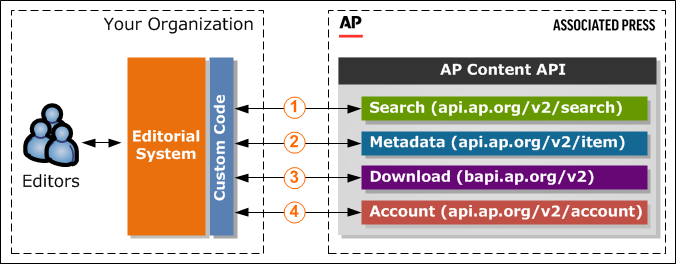

# AP Content API V3

[About AP Content API](#about-content-api) 
- [Typical Workflow Overview](#typical-workflow-overview) 
- [API Keys](#api-keys)
- [Supported Protocols](#supported-protocols)
- [Client Implementation Requirement](#client-implementation-requirement)
- [Recommended Practices](#recommended-practices)

[Release Notes](Release-Notes.md)

[Preview Guidelines](Preview-Guidelines.md)

[Search and Feed](Search-and-Feed.md)
- [Search Method](Search-and-Feed.md#search-method)
- [Feed Method](Search-and-Feed.md#feed-method)
- [Supported Query Syntax](Search-and-Feed.md#supported-query-syntax)

## About Content API

Content API allows you to search and download content using your own editorial tools, without having to visit our portals, such as [apimages.com](http://apimages.com).
The API provides access to:
- _Images_. AP-owned, member-owned and third-party images, including the full AP Images archive and the GraphicsBank collection.
- _Video_. AP-produced and select third-party video.

> **_Important:_**
  - Content available to you via the API depends on your plan. Please refer to contract information for details and contact your AP Sales or Licensing representative with any questions.
  - If you currently access images via Content API and are interested in accessing video, please contact your AP Sales representative for more information.

### Typical Workflow Overview

_Work with your own editorial system_. Your editors search and download AP Images and AP Video content using your own editorial tools:

1. _Run a search._ When an editor performs a search in your editorial system, your custom program searches the AP Images or AP Video collection and displays search results along with key metadata. Content item pricing is available upon request.
2. _Pick a result to view metadata._ When an editor selects a search result, your custom program retrieves full content metadata (optionally, with pricing) from the AP Content API system.
3. _Download content._ When an editor wants to download an image or video file, your custom program downloads the requested content file from the AP Content API system.
4. _Review your account information._ When an editor wants to check how many downloads available for your plan have already been used or download your order history, your custom program retrieves your plan and usage information or order history from AP Content API.

### API Keys

An API key is the access key required for making API calls. If you have not received your API key, please contact Customer Support.

### Supported Protocols

- HTTPS 1.1 is supported for the API calls to _api.ap.org_. 
- HTTP 1.1 is supported for the API calls to _bapi.ap.org_.

### Client Implementation Requirement

The implementation of your client application must allow new data elements and attributes to be added by AP by ignoring any markup that it does not recognize.

### Recommended Practices

It is recommended that your client application download content item renditions or retrieve full metadata using the _links returned in search results_ instead of constructing those links.

> _Note:_ This practice is also beneficial since the links returned in search results may contain additional optional parameters used for performance or troubleshooting.

> **_Important:_** To receive pricing information in the Item Metadata method responses, make sure to add the _showPricing=true_ parameter to the item metadata links along with the _apiKey_ parameter.

[Back to Top](#ap-content-api-v3) 